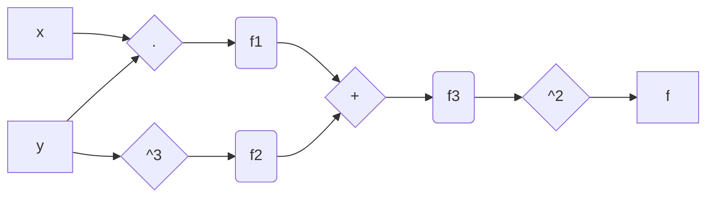
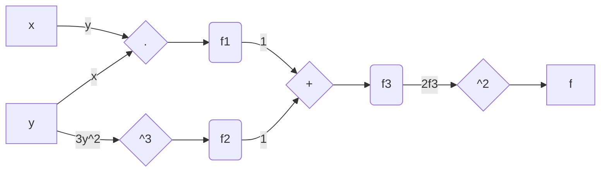
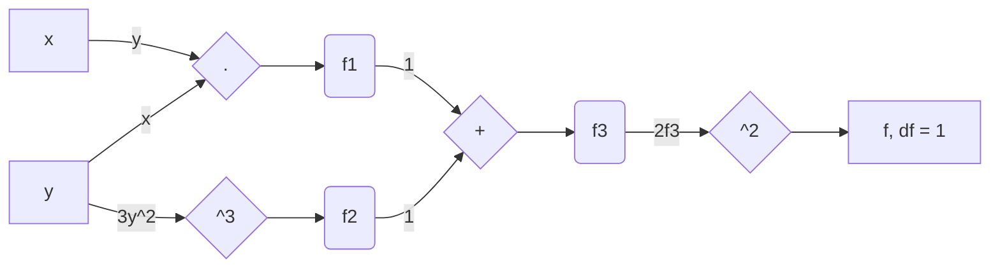
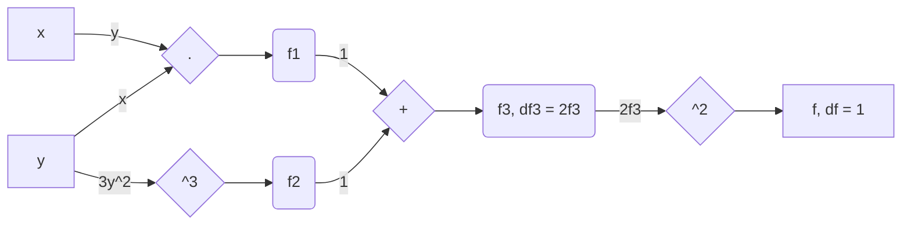
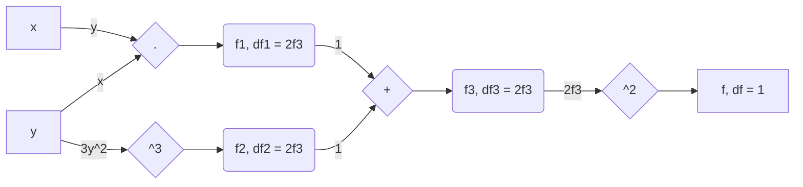
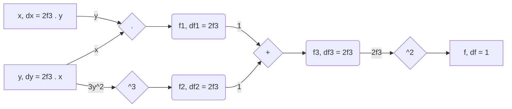
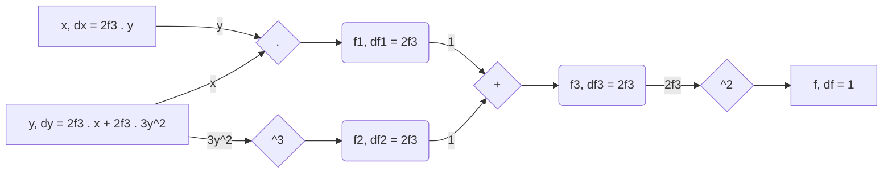

# JAC
JAC(obian) is a **simple** Reverse Mode Automatic Differentiation (AD) Library written from scratch in Julia. 

> This is strictly for educational purposes only, as I won't be focusing on performance (per say). 

## Reverse-mode Automatic Differentiation Theory
Theory behind AD is simple. It's all about chain rule! 

Consider a simple function $f(x,y)=(xy+y^3)^2$, and the task is to evaluate the **exact derivatives** of $f$ with respect to $x$ and $y$, i.e. $\frac{\partial f}{\partial x}$ and $\frac{\partial f}{\partial y}$. I'm sure you can compute these by hand but it would be nice to have a computer program evaluate exact derivatives *automatically*. This will come in handy if the function changes to say $f(x,y)=(xy+y^3x^4)^3$, and you don't have to rewrite a single line of code! 

### Forward Pass

What an **AD Engine** does is break down the complex function into simpler sections involving a single operation. For example, $f(x,y)=(xy+y^3)^2$ can be rewritten as

$$f_1 = x \cdot y \tag{1}$$

$$f_2 = y^3 \tag{2}$$

$$f_3 = f_1 + f_2 \tag{3}$$

$$f(x,y) = f_3^2 \tag{4}$$

A nice way to visualise these operations is on a **computation graph** as shown below

Now, we can evaluate derivatives easily for each of these equations separately

$$\frac{\partial f_1}{\partial x}=y; \ \ \ \frac{\partial f_1}{\partial y}=x \tag{5}$$

$$\frac{\partial f_2}{\partial y}=3y^2 \tag{6}$$

$$\frac{\partial f_3}{\partial f_1}=1; \ \ \ \frac{\partial f_3}{\partial f_2}=1 \tag{7}$$

$$\frac{\partial f(x,y)}{\partial f_3}=2f_3 \tag{8}$$

Let's just call these **Local Derivatives** as they're defined locally on the each step. We can represent these on the graph as well

### Reverse Pass

Getting the desired **Global Derivatives** is just a matter of moving through the graph in reverse (hence the name **Reverse-mode Automatic Differentiation**). Let me demonstrate that step by step

**Step 1**

Start with the derivative of $f$ with respect to $f$, which is always $1$. 

$$\frac{\partial f}{\partial f} = 1 $$

**Step 2**

Next, we can get the global derivative of $f$ with respect to $f_3$ by multiplying global derivative of $f$ with respect to $f$ (defined in the previous step) and local derivative of $f$ with respect to $f_3$ (defined in equation $8$).

$$\frac{\partial f}{\partial f_3}=\frac{\partial f}{\partial f} \cdot \frac{\partial f}{\partial f_3}=1 \cdot 2f_3$$

**Step 3**

Now, move through the addition operation and do the same thing for $f_2$ and $f_1$.

$$\frac{\partial f}{\partial f_1}=\frac{\partial f}{\partial f_3} \cdot \frac{\partial f_3}{\partial f_1}=2f_3 \cdot 1$$

$$\frac{\partial f}{\partial f_2}=\frac{\partial f}{\partial f_3} \cdot \frac{\partial f_3}{\partial f_2}=2f_3 \cdot 1$$

**Step 4**

Looking along the $f_1$ path

$$\frac{\partial f}{\partial x}=\frac{\partial f}{\partial f_1} \cdot \frac{\partial f_1}{\partial x}=2f_3 \cdot y$$

$$\frac{\partial f}{\partial y}=\frac{\partial f}{\partial f_1} \cdot \frac{\partial f_1}{\partial y}=2f_3 \cdot x$$

Even though we have $\frac{\partial f}{\partial x}$ and $\frac{\partial f}{\partial y}$, **remember that the path along $f_2$ is still left**.

**Step 5**

Along the $f_2$ path, we'll get $\frac{\partial f}{\partial y}$. Notice that we already have a derivative value in that node. So what we do here is just add these two together.

$$\frac{\partial f}{\partial y}=\frac{\partial f}{\partial f_1} \cdot \frac{\partial f_1}{\partial y} + \frac{\partial f}{\partial f_2} \cdot \frac{\partial f_2}{\partial y}=2f_3 \cdot x + 2f_3 \cdot 3y^2$$

### Final Results

Using AD, we get the following derivatives

$$\frac{\partial f}{\partial x}=2f_3 \cdot y = 2(f_1 + f_2)\cdot y = 2(xy + y^3)\cdot y$$

$$\frac{\partial f}{\partial y}=2(xy + y^3) \cdot x + 2(xy + y^3) \cdot 3y^2$$

> Go ahead and solve the derivatives by hand, you'll get the same answer!

### Conclusions
The purpose of me writing an AD library from scratch is to get a deep understanding of how this works. For details regarding the actual code implementation, visit the [website](https://tgautam03.github.io/jac.jl/dev/) where I explain each and every step in detail.