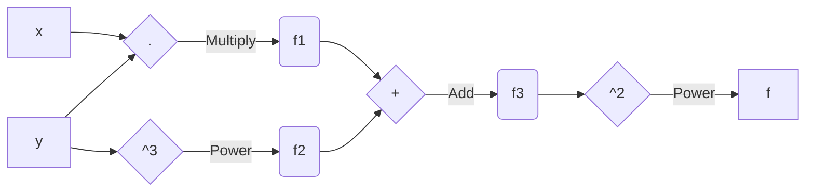
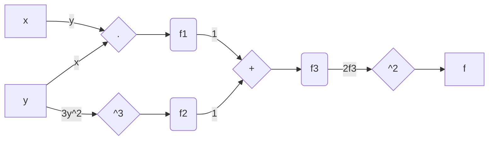

# JAC

JAC(obian) is a **simple** Reverse Mode Automatic Differentiation (AD) Library written from scratch in Julia. 

> This is strictly for educational purposes only, as I won't be focusing on performance (per say). 

## Reverse-mode Automatic Differentiation Theory
Theory behind AD is simple. It's all about chain rule! 

Consider a simple function $f(x,y)=(xy+y^3)^2$, and the task is to evaluate the **exact derivatives** of $f$ with respect to $x$ and $y$, i.e. $\frac{\partial f}{\partial x}$ and $\frac{\partial f}{\partial y}$. I'm sure you can compute these by hand but it would be nice to have a computer program evaluate exact derivatives *automatically*. This will come in handy if the function changes to say $f(x,y)=(xy+y^3x^4)^3$, and you don't have to rewrite a single line of code! 

What an **AD Engine** does is break down the complex function into simpler sections involving a single operation. For example, $f(x,y)=(xy+y^3)^2$ can be rewritten as

$$f_1 = x \cdot y \tag{1}$$
$$f_2 = y^3 \tag{2}$$
$$f_3 = f_1 + f_2 \tag{3}$$
$$f(x,y) = f_3^2 \tag{4}$$

A nice way to visualise these operations is on a **computation graph** as shown below

Now, we can evaluate derivatives easily for each of these equations separately

$$\frac{\partial f_1}{\partial x}=y; \ \ \ \frac{\partial f_1}{\partial y}=x \tag{5}$$
$$\frac{\partial f_2}{\partial y}=3y^2 \tag{6}$$
$$\frac{\partial f_3}{\partial f_1}=1; \ \ \ \frac{\partial f_3}{\partial f_2}=1 \tag{7}$$
$$\frac{\partial f(x,y)}{\partial f_3}=2f_3 \tag{8}$$

Let's just call these **Local Derivatives** as they're defined locally on the each step. We can represent these on the graph as well

Getting the desired **Global Derivatives** is just a matter of moving through the graph in reverse (hence the name **Reverse-mode Automatic Differentiation**). Let me demonstrate that step by step

